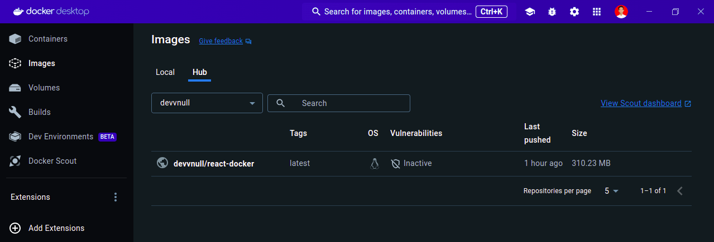

# Quick Start

## Pre-requisites

Make sure you have the following installed on your machine:

- Git
- Node.js
- npm (Node Package Manager)
- Docker

## Cloning the Repository

```bash
git clone https://github.com/armandwipangestu/learn-docker
cd learn-docker
```

## Running `hello-docker`

- Build image

> **Note**:
>
> `-t`: this is option for tag, if empty it will be used `latest` for default
> `hello-docker`: this is for the image name
> `.`: this mean use the current `Dockerfile` configuration

```bash
cd hello-docker
docker build -t hello-docker .
```

- List docker images

```bash
docker images
```

- Running the image

> **Note**:
>
> This will make container to running from the image.
>
> You can add some option/flag to make interactive the running container. e.g.,
>
> ```bash
> docker run -it hello-docker sh
> ```

```bash
docker run hello-docker
```

## Running `react-docker`

- Build image

```bash
cd react-docker
docker build -t react-docker .
```

- Running the image

```bash
docker run react-docker
```

- Running the image with expose port

> **Note**:
>
> Because this is React.js application using vite, so this app will run on port `5173`. If you run the docker with this command
>
> ```bash
> docker run react-docker
> ```
>
> This app will run but not be expose to the machine host, so you can't access the app directly from your browser machine host. To handle this you must add specific option/flag to expose the port. You can use `port mapping` like this
>
> `5173:5173`: The first port this mean is the machine host port, and the second port is the port inside container. If you familiar with networking, this is like port forwarding. You can imagine, when you access the `localhost:5173` from the browser machine host, under the hood it will be forward to the `5173` port on the container app
>
> If you already `port mapping` the docker run but still can't access from the browser machine host. The problem can be from the `vite`, because the default vite will not be bind to the another network (the default just bind to `localhost`). So you can change the configuration vite on `package.json` with the option/flag `--host` like this
>
> ```json
> {
>    ...
>    "scripts": {
>       "dev": "vite --host",
>       ...
>    }
>    ...
> }
> ```

```bash
docker run -p 5173:5173 react-docker
```

- Running the image with code change detected

> **Note**:
>
> If you run the docker with this command
>
> ```bash
> docker run -p 5173:5173 react-docker
> ```
>
> It will be running, but when you make some change to the code, it will not be affect to the code in the container. So you must be re-build the image and then run again the container (it will be take times to build and run again the container).
>
> To handle this problem you can make mount the current directory into the `/app` container directory (The `/app` is the WORKDIR of the application, you can check from the `Dockerfile`). This effect means that the local code will be linked to the container and any change locally will be immediately clearly reflected inside the running container. This example running code
>
> ```bash
> docker run -p 5173:5173 -v "$(pwd):/app" react-docker
> ```
>
> The option/flag `-v` this is stand for the `volume` that beucase we need the volume to keep track all of those changes. Volume they try to ensure that we always have data store somewhere.
>
> But before run this command, that one last option/flag need to be assign, that is another `-v` but this time for the `/app/node_modules`
>
> Why we need this? because we need a new volume for the `node_modules` directory with the container, we do this to ensure volume mount is available it container. So now if we run the container it will use existing `node_modules` from the name volume, and any change to the dependencies want require to reinstall when starting the container.
>
> This is particularly useful when developing scenarios when you frequently start and stop containers during code changes.

```bash
docker run -p 5173:5173 -v "$(pwd):/app" -v /app/node_modules react-docker
```

## Publish images to the Docker Hub

- Login to the user

```bash
cd react-docker
docker login
```

- Create new image with existing image

> **Note**:
>
> This command will create a new image from the existing image `react-docker` and the name is `<username>/react-docker`. You can change `<username>` with your own username docker account.
>
> The blank `tag` it will be used the default `latest`

```bash
docker tag react-docker <username>/react-docker
```

- Publish the image

> **Note**:
>
> This command will be push the image local to the Docker Hub.

```bash
docker push <username>/react-docker
```


